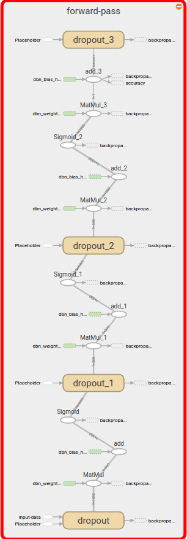

Introducing the learning mechanism
==================================

Basic Structure
---------------

The learning part of Project contains three directories: :file:`frontend`, :file:`networks` and :file:`utils`.

The networks are in :file:`networks`. The package :file:`frontend` is a wrapper for the learning process.
The :file:`utils` is a package containing all helper modules. The helper functions and the structure of :class:`RBM_CDK` is
taken from `GitHub <https://gist.github.com/blackecho/db85fab069bd2d6fb3e7>`_.

:file:`Main` has five function for training and classifying a given dataset. The :meth:`Main.fit_rbm` and :meth:`Main.classify_rbm`
are functions to demonstrate how the training of an RBM would look like. But we only used :meth:`Main.fit_dbn` and :meth:`Main.classify_dbn`
:meth:`Main.fit_dbn` performs a complete pretraining with the given dataset. Then it calls :meth:`DBN.supervised_finetuning`.
With :meth:`Main.supervised_training` we tried to see if pretraining had an effect on our training.

:class:`DBN` has three public functions which hide most of the implementation from the user. But additionally they should give
the user full controll over the learning process. That's why the :meth:`DBN.pretraining` and :meth:`DBN.supervised_finetuning`
give the user access to all hyperparameters and the loading and saving directory. But the training process itself is hidden from
the user.

The class :class:`DBN` uses the the class :class:`RBM` to pretrain the layers. Then it extracts them, adds an additional output
layer and trains them with a supervised finetune method.

Network: RBM
------------

The restricted `Boltzmann machine <https://en.wikipedia.org/wiki/Restricted_Boltzmann_machine>`_
is a unsupervised neural network. The network consists of two layers, the visible and the hidden layer.
The visisble layer has the size of the input data vector. The hidden layer has the size of the number off features it should extract.

The network is learning stochastically and unsupervised with the CD-k algorithm (constrative divergence).

The visualization of this learning algorithm was already used in the :doc:`introduction`.

.. image:: RBM_pretraining_learning_MNIST.png

The input from the visible layer is passed up to the hidden layer and then back down to the visible layer. This process is called
Gibbs sampling step. After a specified number of Gibbs sampling steps the the original input and the sampled input are compared.
The error between the two values is used to adapt the weights of the network.

For a more in depth description of this network see the `introductionto restricted Boltmann machines <http://image.diku.dk/igel/paper/AItRBM-proof.pdf>`_
or the `practical guide on how to train them <http://ai2-s2-pdfs.s3.amazonaws.com/77c3/cf0e846a8485acf82beed186c086d9d9e68b.pdf>`_

Network: DBN
------------

In the paper `A fast learning algorithm for deep belief nets <https://www.cs.toronto.edu/~hinton/absps/fastnc.pdf>`_ the author
describes a procedure to stack multiple RBMs on top of each other. Each one is trained unsupervised and then the next network takes
the output of the previsous one to train itself. This can be done multiple time and every time more features are learned.
This is a way of effectively pretrain a `Deep Belief Network <https://en.wikipedia.org/wiki/Deep_belief_network>`_.[HintonPretraining]_

After the pretraining supervised backpropagation can be used to train an effective discriminative model.[HintonDiscrim]_

The pretraining helps to kind of initialize the weights for the supervised training. So the networks learning progress is better.
It also limits the amount of labeled training date which is needed to train the model.

The supervised training is visualized by this Tensorboard graph:

For the supervised training we only had 300 labeled data touples. That's why after the network generates it's own training data after
the first two epochs.::

    dbn.supervised_finetuning()

    examples = input.next_batch(100 + 5 * i)

    prediction = dbn.classify(examples[0])

    train_set.append(examples[0], prediction)

With this technique we are trying to prevent the network from overfitting.

.. [WikiBoltz] https://en.wikipedia.org/wiki/Restricted_Boltzmann_machine
.. [WikiDBN] https://en.wikipedia.org/wiki/Deep_belief_network
.. [HintonDiscrim] https://www.youtube.com/watch?v=43hJRLhRidg
.. [HintonPretraining] https://www.youtube.com/watch?v=8fHpaKm9x4w