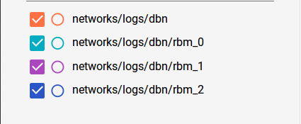

Get Started with Tensorflow
===========================

Installation
------------
The program mainly uses `Tensorflow <https://www.tensorflow.org/>`_ and `numpy <http://www.numpy.org/>`_ and python 3.5.

Tensoflow can be installed via pip install. Additional installation Methods can be found at
`Tensorflow.org <https://www.tensorflow.org/get_started/os_setup>`_. Tensorflow offers an additional version to run
your program on a GPU. The website offers a describtion on how to use
`NVIDIA GPUs <https://www.tensorflow.org/how_tos/using_gpu/>`_
, but this code is only programed and tested for CPUs.

Basic usage of Tensorflow
-------------------------

To get a better understanding of python we take a look at program example from `Tesorflow.org <https://www.tensorflow.org/get_started/>`_.

First Tensorflow and numpy have to be imported.::

    import tensorflow as tf
    import numpy as np

Then we create our input data and the desired output. These are saved as numpy arrays. Numpy arrays can be easyly converted
in to Tensorflow Variables.

Next we specify the Tensorflow variables we want to use. In this case we create one weight and one bias variable. For the
initial values of W and b we use helperfunction, which create a numpy array for us.::

    W = tf.Variable(tf.random_uniform([1], -1.0, 1.0))
    b = tf.Variable(tf.zeros([1]))

Next we specify the computation Tensorflow should perform. But this listing of commands isn't executed yet. We are only
building a computation graph. Later on Tensorflow optimizes the graph and compiles it in a C language for maximum efficiency.::

    y = W * x_data + b

The variable y defines the prediction of the network. To correct the prediction we use an build in optimizer. Which minimizes our
error.::

    loss = tf.reduce_mean(tf.square(y - y_data))
    optimizer = tf.train.GradientDescentOptimizer(0.5)
    train = optimizer.minimize(loss)

Now that our computation graph is complete we let Tensorflow run it. First we initialize our Variables.::

    init = tf.global_variables_initializer()
    sess = tf.Session()
    sess.run(init)

The session is an abstract object which helps us managing our computations. With sess.run(init) the init node is run.
Within this session our variables are initialized.

In a simple for loop we now can run our training-graph.::

    for step in range(201):
        sess.run(train)
        if step % 20 == 0:
            print(step, sess.run(W), sess.run(b))

Like the sess.run(train) the sess.run(W) evaluates the W variable and returns a numpy array which represents the values saved in
W.
During the training the variables learn to fit the values W: [0.1], b: [0.3].

Further reading
---------------

For a more in depth tutorial about Tensorflow you can check out the mnist turial for `beginner <https://www.tensorflow.org/tutorials/mnist/beginners/>`_
and for `experts <https://www.tensorflow.org/tutorials/mnist/pros/>`_.

`Tensorflow Mechanics 101 <https://www.tensorflow.org/tutorials/mnist/tf/>`_ presents you additional features of Tensorflow.

Tensorboard
-----------

Tensorboard is a tool which is included in Tensorflow. With Tensorboard you can visualize your training data. In your project we
used Tensorboard to keep track of our accuracy, loss and weight development. Additionally it visualized our computation graph.

To use Tensorboard, especially to visualize some of our test runs go to the logs directory in our project and open a Terminal in one
of the containing folders. Then type the command.::

    tensorboad --logdir .

In the following image you can see the progress of 3 restricted Boltzmann machines during pretraining from a MNIST dataset:

.. image:: RBM_pretraining_MNIST.png

We added also some of the hyperparameters to the observed variables. So we could directly link the loss to the corresponding
hyperparameters.
As we can see as the training starts the loss is jumping up and down but the trend is a decreasing loss. After some time the
loss is stabilized. Even an increasing Gibbs sampling rate can change that.
Two other important graphs are the maximal and minimal weights. As the training progresses the absolut value of the maximal and the minimal weight
are getting higher. That isn't a development we want. Optimally the weights should always stay between -1 and 1.
One explanation could be that we are overtraining because your loss is stuck but we keep training. That forces some weights
to become extremly big or small. Even the weight decay regulization can't stop that.

In the next image is one of the RMBs visualized by Tensorboard:

.. image:: RBM_pretraining_learning_MNIST.png

This is the main part of the learning precedure from our RBM. As you can see the x-input and the weights and biases perform a Gibbs sampling step.
The inforamtion on how is currently hidden to make the presentation easier to understand. With the first sampling step
the positive association can be calculated. And the value is later used to calculate delta. The thicker the line the more data
is flowing between the nodes.

To create our own visualizations in Tensorflow we need to tell Tensorflow which information are importan.
In the following code block are the summary_nodes we used to create these graphs.::

    with tf.name_scope('summaries'):
        with tf.name_scope('learning_progress'):
            tf.summary.scalar("loss", self._tf_loss_function)
        with tf.name_scope('weight_development'):
            tf.summary.scalar("max_Weight", tf.reduce_max(self._tf_w))
            tf.summary.scalar("min_weight", tf.reduce_min(self._tf_w))
            tf.summary.histogram("delta_weights", self._tf_delta_w)
            tf.summary.histogram("weights", self._tf_w)
        with tf.name_scope('hyperparameter'):
            tf.summary.scalar("_learning_rate", self._learning_rate)
            tf.summary.scalar("Gibbs_sampling_steps", self._gibbs_sampling_steps)

I used Tensorflows namespace to section them. The same namespaces are used in the computation graph to abstract information
from the user.::

    with tf.name_scope('learning_process'):
        with tf.name_scope('gibbs_sapmling_step'):
            #first Gibbs sampling step
        with tf.name_scope('_compute_positive_association'):
            # positiv association

        with tf.name_scope('gibbs_sampling_steps'):
            # n-1 additional Gibbs sampling steps

        with tf.name_scope('compute_negative_association'):
            # negative association

        with tf.name_scope('calculate_delta_weights'):
           # delta weights

        with tf.name_scope('update_weights'):
            # weight updates

The information of the summary nodes is evaluated by the call of merge_all_summarys.::

    self._tf_merged_summaries = tf.summary.merge_all()

    # later the node is run
    loss, summary_str = self._tf_session.run([self._tf_loss_function, self._tf_merged_summaries],
                                             feed_dict=self._create_feed_dict(train_set))

    # and saved in a directory by tf.train.Summary_writer
    self._tf_summary_writer = tf.train.SummaryWriter(self.summary_dir, self._tf_session.graph)

    self._tf_summary_writer.add_summary(summary_str, epoch)

If we specify the Tensorflow graph, the computationgraph is visualized in Tensorboard as seen above.

Topic
-----

How does Tensorflow save and load models.
My implementation of the saving and looading mechanisms in RBM and DBM