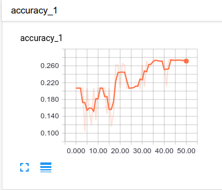
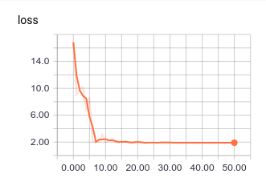
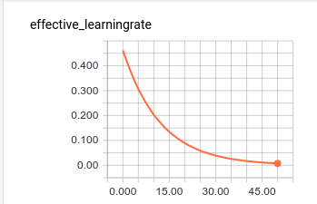
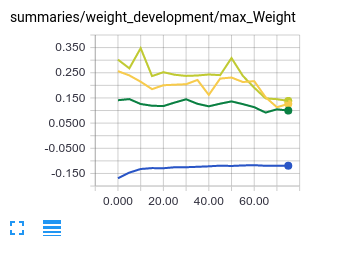
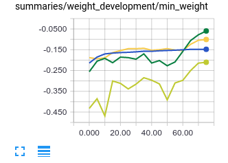

Test and Validation that the network is working
-----------------------------------------------

MNIST on both networks performed.
Obeserving of loss and with supervised training observe the training accuracy.

RBM
^^^

The RBM got first tested with the MNIST dataset provided by google(link).
The training progresses as described by the paper.
After this we couldn't test the accuracy because the unsupervised learning network didn't knew how the numbers are labeled.
It just could see the differences. But with the getImage function from (link) we got a nice representation of our learned
states.

Also most of the code is taken from github(link)

DBN
^^^

The dbn was also tested by the mnist dataset. We succeeded in learning the MNIST data up to 92%.
That was the prove that it worked.
But maybe this wasn't enough. We hadn't got any other test cases. But we hat Tensorboard to visualize the most important
facts we needed to evaluate the preformance of our model

Experiment Results
==================

The task was to write a automated classifier for GitHub repositorys.

Our idea was it to use a unsupevised network. We found out that you can stack multiple restricted Boltzmann machines to form a
Deep Belief network which has much better problem solving abilities. But we needed a discriminativ model. That's why we classified
some repositorys by hand. With this data set we could finetune the DBN and then use the DBN to generate new training data and contiune the training.

For your network we used Tensorflow with numpy to build the network. The introduction on how to use them can be found on the
:doc:`introduction` page. All testresults are visualized with Tensorboard.

First Experiments
-----------------

Our first run with only 4700 unlabeled datasets wasn't really succefull. The hyperparameters were as followed:

================== ================== ================== ==================
Hyperparameter         Values 1         Values 2         Values 3
================== ================== ================== ==================
Epochs                  100              100               100
Batchsize               10               100               100
learningrate            0.1              0.01              0.005
Gibbssamplingsteps      1                3                 5
Momentumterm            0.5              0.9               0.9
Weightdecay             0.0001           0.0001            0.0001
================== ================== ================== ==================

Each layer is trained with the same 3 values.

Network structure: [1370, 500, 500, 1500, 7]

Accuracy got never over 16%. Sometimes way worse. But the weights stay small which was a win for us.
The choice of Opitmizer and learning rate for the finetuning part didn't had any effect on the testresults.

Next try with almost the same parameters but this time with 31700 unlabeled data sets. The initialization was long and the
input vector got up to 7300. The program took just 3GB but after the first epoch the memory usage doubled. We expect that
the :meth:`np.random.shuffle` and the ne permutated image and label array are the reason why the memeory usage exploded. In previouse tests
wasn't this in issue. We expect that there had to be some kind of an bug.

Because of this we had to constrain the input vector. Every word which happens to occure to few or too much is cut out of the vector.

After this we ended up with 1636 in input vector size. The hyperparameters for the third test were as followed:

================== ================== ================== ================== ==================
Hyperparameter         Values 1         Values 2         Values 3            Values 4
================== ================== ================== ================== ==================
Epochs                  10               50                50                50
Batchsize               10               10                10                10
learningrate            0.1              0.01              0.005             0.001
Gibbssamplingsteps      1                1                 3                 4
Momentumterm            0.5              0.9               0.9               0.9
Weightdecay             0.0001           0.0001            0.0002            0.0002
================== ================== ================== ================== ==================

Network structure: [1636, 500, 500, 1500, 7]

We tested all possible optimizers netstructures and hyperparameters and came to the conclusion that single words aren't
usefull for a classification problem if they are used without a context.

New Inputvector
---------------

So we tried a new short input vector. Which encoded the following things:
#. Number of files in the repository
#. Number of commits
#. Number of open issues
#. Number of closed issues
#. Number of closed issues
#. Number of Users how left a comment
#. Number of Users how commited something

Every of these parameters was normalized relativly to the number of ... in the whole data set.
But we observed that the network couldn't even learn a small dataset. To prove this we let the network train with our
supervised dataset and test every epoch how many of them it could classify correctly.
We never did crack the 21% accuracy rate. That's why we reconstructed the vector again this time we made the value relative
to the other values in the repository. Because we expected that all of the given parameters are also kind of dependent how
big the repository is.
New vector:
#. Number of Files / the number of maximal possible files
#. Number of comments / Number of commits
#. Number of open issues / number of closed issues
#. Number of authors / number of files
#. Number of users who commited / number of files

But still the network couldn't even find a relatively good solution for all our 300 trainsets.

New Normalization Methods
-------------------------

Our hypotheses is that we chose a poor input vector. The network could't tell 300 networks apart by the presented values.
Although the network should be able to memorys the class of the different inputvectors.

That's why we tried to find a better fitting one. That was our biggest concern. If the network could tell our 300 vectors apart
it probably could learn more and generalise this idea.

New kind of Weight decay in rbms to controll the jumping weight growth.

The new vector we tested uses almost the same input values but this time we weren't trying to make them relative to each other.
As in this post (insert post here) isn't the scale of the input that important. We will just normalize the vector to prevent the values in
the vector from getting to big.

We tried a new method of normalizing the values between 1 and 0.
We used the :meth:`tensorflow.nn.l2_normalize` function. The trainingresults with a [6, 50, 100, 200, 400, 7] net
were slightly over our previously tested ones. we got up to 33% accuracy.

The shown graphs present the training progress of this netowork. We used a exponential decaying learning rate with a :class:`ProximalAdagradOptimizer`.
The l1 = 0.0001 and l2 0.001. Pretraining was with the following paramenters:

================== ================== ================== ================== ==================
Hyperparameter         Values 1         Values 2         Values 3            Values 4
================== ================== ================== ================== ==================
Epochs                  10               45                10                10
Batchsize               10               10                10                10
learningrate            0.1              0.01              0.001             0.0001
Gibbssamplingsteps      1                1                 3                 4
Momentumterm            0.5              0.9               0.9               0.9
================== ================== ================== ================== ==================

Keep in mind that the graph is smoothed by Tensorboard. That's why the 30% accuracy isn't visible.

But this time we changed the weight decy mechanic. Each entry in weight_dacy parameter coresponds to one RBM network.
Because we observed that the first one or two networks tend to have huge weights, therefore they get a higher weight penalty.
On the other side the later networks are more likely to have too small weights, when they have the same big learning rate as the early networks.

With this change the networks had a better weight development. The highest or lowest weights have a good initial value for the finetuning as
it can be seen here:

The graphs are saved in logs data_normalized_2. With Tensorflow you can display the graphs ourself, toghether with additional
information about the training. (:doc:`introduction`)

We also tested to shift the values of our training_set with a mean of 1 and
variance of 0.

In `this tutorial <http://r2rt.com/implementing-batch-normalization-in-tensorflow.html>`_ they used this normalization technique to normalize
the output of every layer in the neural network. We tried to use it as a way to normalize our input data into the first layer.
In this testcase with the same pretraining as done before only with differently normalized data. This strategy doesn't worked out.

Other changes
-------------

Throughout the testing of the project we always did change parts of it here and there. But because we initially hadn't a working network
we couldn't determine if these changes were more or less usefull. Simply because it had no effect on the networks accuracy.

The learningrate

The learning rate during pretraining was initially 0.001 - 0.00001 divided by the batch size. This value was originally from our tests with the
MNIST dataset. With a higher learning rate the loss couldn't decrement because the learning rate was too high.

After some time we decided to start with learningrate higher and degrade them over time. The pretraining results were much better
because the change in the loss was higher and most of the networks had an 20% accuracy after the first finetuning epoch.

Nettopologie

The network shrunk naturally after we thinned the input vector.
But during the testing process we tried different topologies:

#. [1600, 500, 500, 2000, 7]
    The vector is transposed into a smaller dimension were features are extrated. The second last layer then represents a vector with
    2000 features. The supervised training can now extract the features it need to make the classification. The network learns more features
    than it needs but we can be sure the right one will be in there. This technique is inspired by the MNIST approach with pretraining.

#. [1600, 700, 500, 200, 500, 7000, 20000, 7]
    This is a huge network. But it can also be done with a smaller input vector and therefore smaller interiare layers.
    This topologie is inspired by autoencoders. First the input value is slowly compressed into a smaller vector.
    The second half of the network then reconstructs the input and gives an prediction.

#. [6, 200, 100, 50, 25, 7] or [1600, 800, 400, 200, 100, 7]
    This is the standard way of composing a neural network. The First layer is either turned into a bigger one or directly transformed
    into a smaller vector. The first version had some problems because the if we choose the second layer to big the weight tended to explode in
    the first weight matrix. That's why we used the above method to slowly higher the layer size.s

#. [6, 75, 7]
    This is the shallow version of a network. We tried this version to test if maybe the additional layers lower the accuracy of our network
    because they may not be needed.

Neurontypes

We started with a simple sigmoid activation function and a softmax layer at the last layer.
But in some literature and fores was suggested that the reLU neuron can improve the performance of a network by reducing the
effect vanishing gradient.
We also added a dropout rate of 50% to the network to prevent overfitting becaus we had just a small training set.

The training set

Because we had just so few training examples we early on decided to use pretraining to shorten the time our network needs to train
and maybe prefent it from overfitting.
Another idea to prevent overfitting is to let the network predict classses for the unlabeled data and add them to the supervised learning block.
This idea can be seen in :meth:`Main.fit_dbn`. It's not used at the moment because the network itself isn't learning properly.

Optimizers and errorfunctions

We tetsted most of the available optimizers of Tensorflow. The obvious gradient decent algorithm was unstable when we didn't used the
prefect hyperparameters. Additionally the weights tended to overfit. The AdagradOptimizer got the most stable learning progress.
The :class:`ProximalAdagradOptimizer` and :class:`ProximalGradientDecentOptimizer` can be used as their not proximal counter part but
the offer additional build-in l1 and l2 regulisation. So they prevented the network effectively from overfitting.

As error function we used the :meth:`tensorflow.nn.softmax_cross_entropy_with_logits`. This allows just one of the neurons to be active.
An alternative would have been the cross entropy as the sum of the scared error. This would have allowed multiple neurons to be active at
the same time. But our trainingset just consisted of only one class solutions.

So we use the softmax version as default.

Pretraining

We variet the length of the training a little bit but we always stuck to the same plan of decaying the learning rate over time and meanwhile
increasing the number of gibbs sampling steps.
We tried to set the learning rate of the third trainingstep to 0.1. The network should use this as an oppertunity to escape the
local minima it might be stuck in. But instead it just provoked higher weights values and a worse loss value. Then when the next training
step started the network got back to it's state after the second trainingiteration.
One change that we kept is from (Quelle von How to train RBM) to set the initial momentum term to 0.5 for a short amount of time
we couldn't really detect a difference.
One bigger change was to use binary states as input for all networks. Previously we just turned the input for the first layer
into binary digits. But because we had the theory that the network is stuck in a local minima the stochastic natur of pretraining
with binary states should prevent this.

Evaluation
^^^^^^^^^^

Kurze zusammenfassung der Ergebnisse des aufbaus und so weiter

danach was hat functioniert was nicht

Warum

Gründe beim Netzwerk
eher nicht bei uns :D

Auf diesen Grundlagen evaluieren ob der Ansatz falsch war
was man im nachhinein hätte besser machen können.

Wie kann man solche fehler vermeiden (Tests, Infos)

Sagen das man trotzdem mit der Leistung ergebnis zufrieden ist auch wenn es überhaupt nciht das ist was man sich vorgstellt hat.

We developed a network which is easiely configureable. But has some restrictions in how to use it. For example isn't it possible to use early
stopping or continue training at every chosen point. But the network documents itself in Tensorboard and can be used
for all different kind of task. The Main interface is a little bit special but the DBN and RBM is as general as possible.

Found out which different things we can use to influence the behaviour of the network. Also tested different kinds of input(Jan's abschluss statement).
We can prevent the network from overfitting. Fight the vanishing gradient and prevent the weights from exploding. Although
the weights are greatly initialized with the pretraining.

The network is most likely functioning we already tested that with the MNIST dataset. Although we mad changed that we didn't tested
with this dataset so it could be possible that one of our design desicions broke the network.
More likely is that we chose a bad input vector. Or our idea is complete wrong.

But we wanted to use a deep network because the task look quiet complex. A shallow network or the k-means algorithm
seems unlikely to work.

Because the Deep neural network is such a complex construct we weren't able to pinpoint our mistakes and why the network ins't performing well.
That made it really problematic to find a solution because couldn't determine if our changes are now helping or not.
In addition it is dfficult to debug Tensorflow code because it isn't running in python. So we had no direct inside in what
is happening in our network.

The modular architecture and the few interfaces helps developing. But the interfaces were often changed and every team member only
worked on their own small project. So help across the inferface wasn't possible. Three people maybe would have found more ideas then one.

Neural Networks are pretty complex and it is mostly a heuristic decision in how to change the network. But because of the
lack of experience we dind't succeeded in our task.

DBN's are a new field and most of the papers are just suggestions.