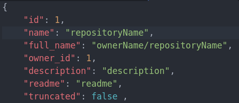
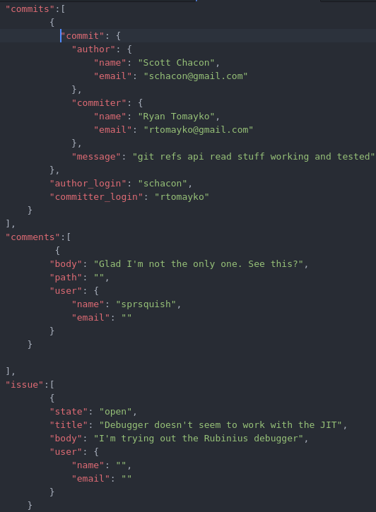

Why is Datapreparation necessary?
=================================

The machine learning network, which we used, requires a normalized vector, tp prevent the values from being too big or small.
The vector hasn't any length requirements, though its values have to be exclusively numerical.
The repository data of GitHub needs to be converted into numerical values to be useful. Also is a the job of this module to
filter the data and only use the useful information.

The Github data
---------------

The first part of the Github data are mainly unique value, such as the repository id or the repository name.
 Except for the author name these wont have much information, so we can ignore them.

.. image:: codeValues.png

The second part covers code-specific values, which are way more interesting. The language part is still irrelevant,
as it stores only informations about code-based projects. The file and tree informations however can be extracted and used for analyzing folder names or file extensions.

This is the most important part of our data. Here we can see everything, that is related to the repository itself,
such as its commits or issues. These will be core for analyzing the data.

All the data we want to analyze share one problem. All of them are text-based and not numerical values, which we need.
The textual values in the repositories therefore needs to be converted to numerical ones in order to fit the learning network.
This is the purpose of this module named data preparation. Data preparation gets object representations of git repositories
and returns numerical vectors which represent the textual values in an unique way.

How does the conversion work in general?
----------------------------------------
The conversion brings many different problems with it. The most obvious way would be to assign an id to every word that is
used in any of the repositories. With this ids every word can be saved together with his neighbours, so this group of ids
would result in an context for the specific word. This solution would be extremely inefficient and also extremely inaccurate
for our problem. Either the words occur in many documents, so they dont help us identifying the type or they are specific
 enough to dont occur in the same context often enough to come to an occlusion based on these.
